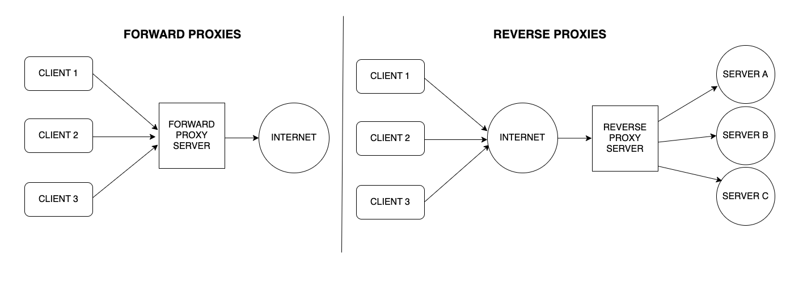

# NGINX reverse Proxy

### What is a port? 

A port is a virtual point assigned with a number, where network connections start and end, these are managed by a computers operating system. each port has a specific process or service and numbering them allows computers to easily differentiate between them. 

### what is a reverse proxy? how is different to a proxy?

A reverse proxy server is a type of proxy server that typically sits behind the firewall in a private network and directs client requests to the appropriate backend server.

Difference between the two:

A traditional forward proxy server allows multiple clients to route traffic to an external network. For instance, a business may have a proxy that routes and filters employee traffic to the public Internet. A reverse proxy, on the other hand, routes traffic on behalf of multiple servers.



### what is Nginx default configeration?

By default, Nginx HTTP server listens for incoming connection and binds on port 80, which represents the standard web port. 

### How to set up a reverse proxy on nginx

1. First thing to do is install and update Nginx on your VM (See appropriate README.md)

2. We then need to disable the defualt virtual host:

- `sudo unlink /etc/nginx/sites-enabled/default`

3. Then we need to create the reverse proxy file name `reverse-proxy.conf` and store it in the directory:

- `cd /etc/nginx/sites-available/`

Then create the file using:

- `sudo nano reverse-proxy.conf`

Within this file we need to add the following:

- 
```
server {
    listen 80;
    location / {
        proxy_pass http://192.168.10.100:3000/;
       }
     } 
 ```

4. Now we can activate the directory with:

- `sudo ln -s /etc/nginx/sites-available/reverse-proxy.conf /etc/nginx/sites-enabled/reverse-proxy.conf`

5. Now we can test the configeration 

- `sudo service nginx configtest`

And restart the server use the new HTTP with:

- `service nginx restart`

Now using http://192.168.10.100/ will take us to our deployed application.

